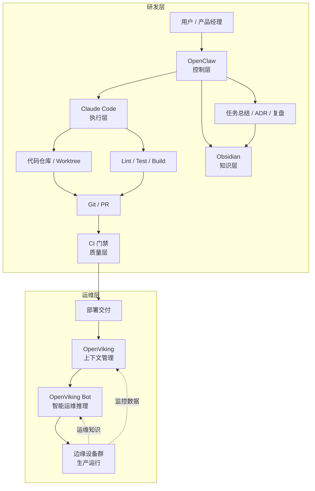

# 02-研发架构

## 研发架构说明

本项目采用 **AIDevault 开发框架**，构建"控制层 - 执行层 - 知识层 - 质量层"四层研发架构。

## 四层结构

### 1. 控制层：OpenClaw

**职责**：
- 接收运维开发需求
- 拆分开发任务
- 调度 Claude Code ACP Session
- 管理会话线程和生命周期
- 汇总执行结果
- 输出任务纪要和复盘

**关键能力**：
```bash
# 任务下发
acpx claude -s oc-claude-openviking-001 "执行 DEV-OV-002：需求分析"

# 会话管理
sessions_spawn --runtime acp --agentId claude-code

# 进程监控
subagents --action list
sessions_list --kinds acp
```

**输入**：
- 用户需求（运维功能开发、架构优化、问题修复）
- Obsidian 项目文档（任务定义、架构设计）

**输出**：
- Claude Code 会话（执行开发任务）
- 任务总结报告（写入 Obsidian）
- 决策记录 ADR（写入 Obsidian）

---

### 2. 执行层：Claude Code

**职责**：
- 阅读代码库
- 生成或修改代码
- 运行测试与构建命令
- 输出变更摘要
- 配合 hooks 落实安全边界

**关键能力**：
```
文件编辑能力：
- Edit：精确修改代码
- Write：创建新文件
- Read：深度阅读代码

代码理解能力：
- 理解现有代码结构
- 分析代码依赖关系
- 识别潜在问题

测试和构建能力：
- Terminal：运行测试
- Build：编译和打包
- Lint：代码检查

终端命令执行能力：
- 执行部署脚本
- 运行监控命令
- 管理边缘设备
```

**输入**：
- OpenClaw 下发的任务
- Obsidian 项目文档（任务模板、开发指南）

**输出**：
- 代码修改（Git 提交）
- 测试结果
- 部署脚本

**安全边界**（Hooks 策略）：
- 限制高风险文件访问（~/clawd 禁止访问）
- 限制生产环境直接操作
- 强制测试通过才能提交

---

### 3. 知识层：Obsidian + Repo Docs

**职责**：
- 存需求分析
- 存架构设计
- 存任务定义
- 存 ADR（架构决策记录）
- 存复盘和经验
- 存环境与发布文档

**目录结构**：
```
/Users/scsun/OpenViking-AIOps/
├── docs/                          # 项目文档
│   ├── 01-项目总览.md
│   ├── 02-研发架构.md            # 本文档
│   ├── 03-运维架构.md
│   ├── 04-开发工作流.md
│   ├── 15-OpenViking-AIOps-开发指南.md
│   └── 16-AIDevVault框架应用分析.md
├── tasks/                         # 任务文件
│   ├── DEV-OV-001.md             # 框架应用分析（已完成）
│   ├── DEV-OV-002.md             # 需求分析（待开始）
│   ├── DEV-OV-003.md             # 架构设计（待开始）
│   ├── DEV-EC-001.md             # 边缘计算模块开发
│   ├── DEV-NM-001.md             # 网络监控模块开发
│   └── DEV-AM-001.md             # AI 模型开发
├── templates/                     # 模板文件
│   ├── 任务模板.md
│   ├── ADR-模板.md
│   ├── openclaw-任务下发模板.md
│   └── claude-code-执行模板.md
├── prompts/                       # 提示词
│   └── openviking-aiops-development.md
└── _index.md                      # 项目导航
```

**知识沉淀机制**：
- **任务文件**：每个开发任务都有对应的 Markdown 文件
- **ADR**：重要架构决策记录在 ADR 文件中
- **复盘文档**：总结经验和教训
- **项目指南**：标准化的开发流程和最佳实践

---

### 4. 质量层：Git + CI + Hooks

**职责**：
- 分支保护
- Lint / Test / Build
- 风险操作限制
- 合并前检查
- 变更留痕

**GitHub Actions 工作流**：
```yaml
# .github/workflows/task-validation.yml
name: Task Files Validation

on:
  push:
    paths:
      - 'tasks/**'
      - 'templates/**'
      - 'docs/**'
  pull_request:
    paths:
      - 'tasks/**'
      - 'templates/**'
      - 'docs/**'

jobs:
  validate:
    runs-on: ubuntu-latest
    steps:
      - uses: actions/checkout@v4
      - name: Check Markdown files exist
      - name: Check Markdown syntax
      - name: Validate task file format
      - name: Check file consistency
```

**质量门禁**：
- **L1 检查**：Markdown 文件格式、语法检查
- **L2 检查**：任务文件一致性、模板符合性
- **L3 检查**：代码 Lint、测试通过、构建成功

**分支策略**：
- `main`：稳定分支，通过 CI 门禁后合并
- `feature/*`：功能分支，用于新功能开发
- `fix/*`：修复分支，用于问题修复

---

## 研发架构图



---

## 研发工作流

### 阶段 1：需求接收

**执行者**：OpenClaw

**步骤**：
1. 接收用户需求（运维功能开发、架构优化、问题修复）
2. 整理需求信息：
   - 任务编号
   - 目标
   - 范围
   - 非目标
   - 验收标准
   - 风险项
3. 创建任务文件（使用模板）
4. 下发任务给 Claude Code

**输出**：
- 任务文件（`tasks/DEV-XXX.md`）
- Claude Code 会话启动

---

### 阶段 2：只读分析

**执行者**：Claude Code

**步骤**：
1. 使用 Glob 查找相关代码
2. 使用 Read 深度阅读代码
3. 分析现有实现方式
4. 识别风险点
5. 输出分析报告

**限制**：
- 只读操作，不修改代码
- 不访问生产环境
- 不执行高风险命令

**输出**：
- 代码分析报告
- 风险识别
- 实施方案建议

---

### 阶段 3：实施编码

**执行者**：Claude Code

**步骤**：
1. 确认实施方案
2. 使用 Edit 修改代码
3. 使用 Write 创建新文件
4. 使用 Terminal 运行测试
5. 使用 Read 验证结果

**限制**：
- 遵循 Hooks 安全边界
- 限制文件访问范围
- 强制测试通过

**输出**：
- 代码修改（Git 提交）
- 测试结果
- 变更摘要

---

### 阶段 4：验证

**执行者**：Git + CI

**步骤**：
1. 运行 Lint
2. 运行单元测试
3. 运行构建
4. 必要的集成验证
5. 通过 CI 门禁

**输出**：
- 测试报告
- 构建报告
- CI 状态

---

### 阶段 5：结果收口

**执行者**：OpenClaw

**步骤**：
1. 汇总执行结果
2. 生成修改清单
3. 分析风险和影响
4. 输出回归建议
5. 生成 PR 文案

**输出**：
- 任务总结报告
- PR 文案
- 回归建议

---

### 阶段 6：知识沉淀

**执行者**：OpenClaw

**步骤**：
1. 更新任务文件（`tasks/DEV-XXX.md`）
2. 创建或更新 ADR（重要决策）
3. 写入复盘文档（经验和教训）
4. 更新项目指南（最佳实践）
5. 更新任务看板（`05-任务看板.md`）

**输出**：
- 更新的 Obsidian 文档
- 知识沉淀完成

---

## 研发工具链

### OpenClaw

**核心命令**：
```bash
# 任务下发
acpx claude -s oc-claude-openviking-001 "执行 DEV-OV-002：需求分析"

# 会话管理
sessions_spawn --runtime acp --agentId claude-code --thread true
sessions_list --kinds acp
sessions_history --sessionKey <session-key>
sessions_send --sessionKey <session-key> --message <message>

# 进程管理
subagents --action list
subagents --action steer --target <agent-id> --message <message>
subagents --action kill --target <agent-id>

# 内存管理
memory_store --text "<information>" --importance 0.7
memory_recall --query "<query>" --limit 5
```

**配置文件**：
- `~/.openclaw/config.json` - OpenClaw 配置
- `~/.openclaw/cron/jobs.json` - 定时任务配置

---

### Claude Code

**核心命令**：
```bash
# 文件操作
claude <filename>     # 打开文件
claude --help         # 查看帮助
claude --model <model> # 指定模型

# Hooks 配置
~/.config/openclaw/hooks/  # Hooks 脚本目录
```

**Hooks 策略**：
- **pre-task**：任务开始前检查
- **post-task**：任务完成后总结
- **pre-edit**：文件编辑前检查
- **post-edit**：文件编辑后验证

---

### Obsidian

**使用方式**：
- 本地 Obsidian Vault：`/Users/scsun/OpenViking-AIOps/`
- Markdown 格式文档
- 双向链接支持
- 标签系统

**插件**（可选）：
- Dataview：数据查询
- Tasks：任务管理
- Calendar：日历视图

---

### Git / GitHub

**分支策略**：
```bash
# 创建功能分支
git checkout -b feature/aiops-monitoring

# 提交变更
git add .
git commit -m "DEV-EC-001: 实现边缘计算模块"

# 推送到远程
git push origin feature/aiops-monitoring

# 创建 PR
gh pr create --title "DEV-EC-001: 实现边缘计算模块" --body "..."
```

---

## 研发原则

### 1. 控制与执行分离

**原则**：OpenClaw 负责编排，Claude Code 负责执行

**实践**：
- OpenClaw 不直接修改代码
- Claude Code 不接收用户直接指令
- 所有任务通过 OpenClaw 下发

---

### 2. 知识与代码分离

**原则**：知识存在 Obsidian，代码存在 Git 仓库

**实践**：
- 任务定义、架构设计、经验教训存储在 Obsidian
- 源代码、测试、配置存储在 Git 仓库
- 通过链接关联两者

---

### 3. 风险操作前置限制

**原则**：高风险操作必须在任务开始前限制

**实践**：
- Hooks 检查文件访问权限
- 禁止访问 `~/clawd` 目录
- 禁止直接操作生产环境

---

### 4. 所有结论必须可沉淀

**原则**：任务执行结果必须写入文档

**实践**：
- 任务总结写入任务文件
- 重要决策写入 ADR
- 经验教训写入复盘文档

---

### 5. OpenViking 不参与研发流程

**原则**：OpenViking 专用于运维环境

**实践**：
- OpenViking 不存储研发知识
- OpenViking Bot 不执行开发任务
- 研发和运维严格分离

---

## 研发成功指标

### 效率指标
- 任务完成时间：平均 < 2 小时
- 任务成功率：> 95%
- 自动化程度：> 80%

### 质量指标
- 代码 Lint 通过率：100%
- 测试覆盖率：> 80%
- Bug 率：< 5%

### 知识指标
- 任务文档完整性：100%
- ADR 记录率：> 80%
- 复盘文档率：100%

---

## 研发风险与应对

### 风险 1：Claude Code 操作边界不清晰

**应对**：
- 使用 Hooks 进行前置检查
- 明确禁止访问的文件和目录
- 定期审计会话日志

---

### 风险 2：项目知识只存在聊天记录中

**应对**：
- 强制所有结论写入 Obsidian
- 定期检查任务文件完整性
- 使用 Git 版本控制 Obsidian 文档

---

### 风险 3：测试与质量门禁不完整

**应对**：
- 完善 GitHub Actions 工作流
- 增加自动化测试覆盖率
- 定期审查 CI/CD 配置

---

### 风险 4：多任务并发导致上下文串扰

**应对**：
- 使用线程隔离会话
- 限制并发任务数量
- 明确任务优先级和依赖

---

### 风险 5：缺少标准任务模板

**应对**：
- 完善任务模板体系
- 定期更新最佳实践
- 创建任务检查清单

---

## 相关文档

- [[01-项目总览]] - 项目总览、双层架构、核心原则
- [[03-运维架构]] - 运维层详细架构设计
- [[04-开发工作流]] - 研发工作流设计（6 阶段）
- [[15-OpenViking-AIOps-开发指南]] - 完整开发指南
- [[templates/任务模板]] - 标准任务文件格式
- [[templates/ADR-模板]] - 架构决策记录模板

---

**文档版本**：v1.0
**创建日期**：2026-03-23
**最后更新**：2026-03-23
**作者**：OpenClaw + scsun
