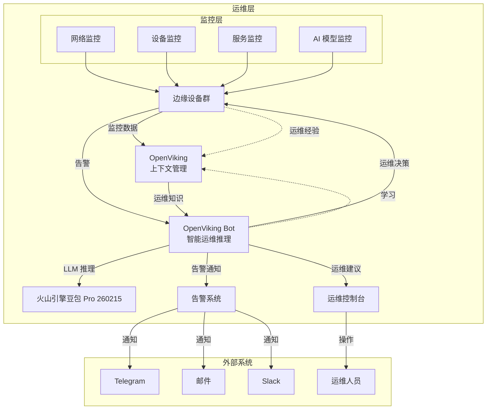

# 03-运维架构

## 运维架构说明

本项目采用 **OpenViking + OpenViking Bot** 构建运维层架构，实现基于边缘计算设备的智能运维系统。

## 运维层结构

### 1. 上下文管理：OpenViking

**职责**：
- 存储运维知识和经验
- AGFS 文件系统（文件系统范式）
- 向量数据库（语义检索）
- 会话记忆管理
- 三级内容访问（L0/L1/L2）

**关键能力**：
```
文件系统管理：
- /agents/：Agent 能力和配置
- /memories/：运维经验和知识
- /resources/：运维资源和工具
- /skills/：运维技能和脚本

语义检索：
- 目录递归检索
- 语义搜索 + 目录定位
- 可视化检索轨迹
- L0/L1/L2 三级访问

记忆管理：
- 自动压缩对话历史
- 提取长期记忆
- 记忆迭代优化
```

**部署环境**：
- **服务器**：172.16.100.101:22
- **端口**：1933
- **模式**：远程服务器模式
- **存储**：`~/.openviking/data/`（容器挂载）

**配置文件**：
```yaml
# ~/.openviking/ov.conf
{
  "server": {
    "host": "0.0.0.0",
    "port": 1933,
    "url": "http://openviking-server:1933"
  },
  "storage": {
    "workspace": "/root/.openviking/data",
    "vectordb": {
      "name": "context",
      "backend": "local",
      "project": "default"
    }
  },
  "embedding": {
    "dense": {
      "model": "doubao-embedding-vision-250615",
      "api_key": "b5bfef6e-dbab-441c-a34b-c4589338b1f0",
      "api_base": "https://ark.cn-beijing.volces.com/api/v3",
      "dimension": 2048,
      "provider": "volcengine",
      "input": "multimodal"
    }
  },
  "vlm": {
    "model": "doubao-seed-2-0-pro-260215",
    "api_key": "b5bfef6e-dbab-441c-a34b-c4589338b1f0",
    "api_base": "https://ark.cn-beijing.volces.com/api/v3",
    "provider": "volcengine"
  }
}
```

---

### 2. 智能运维推理：OpenViking Bot

**职责**：
- 接收运维请求（监控数据、告警、用户查询）
- 通过 LLM 进行智能运维推理
- 执行运维决策（自动修复、告警通知、建议）
- 自动沉淀运维经验和知识

**关键能力**：
```
LLM 智能体：
- 故障诊断和根因分析
- 性能预测和趋势分析
- 异常检测和告警
- 自动修复建议
- 运维经验学习

7 个专用 Agent 工具：
- 资源管理：管理运维资源
- 语义搜索：语义检索运维知识
- 正则搜索：精确检索运维日志
- 通配符搜索：模糊检索运维数据
- 记忆搜索：检索历史运维经验
- 目录操作：管理 AGFS 文件
- 会话管理：管理运维会话
```

**部署环境**：
- **服务器**：172.16.100.101:22
- **端口**：18791（Gateway）
- **Web UI**：http://172.16.100.101:18791
- **会话存储**：`~/.vikingbot/sessions/`
- **工作空间**：`~/.vikingbot/workspace/`

**配置文件**：
```json
// ~/.vikingbot/config.json
{
  "agents": {
    "defaults": {
      "workspace": "~/.vikingbot/workspace",
      "model": "openai/doubao-seed-2-0-pro-260215",
      "maxTokens": 8192,
      "temperature": 0.7,
      "maxToolIterations": 50,
      "memoryWindow": 50
    }
  },
  "channels": [],
  "providers": {
    "volcengine": {
      "apiKey": "b5bfef6e-dbab-441c-a34b-c4589338b1f0",
      "apiBase": "https://ark.cn-beijing.volces.com/api/v3"
    }
  },
  "openviking": {
    "mode": "remote",
    "serverUrl": "http://127.0.0.1:1933"
  }
}
```

---

### 3. 生产运行：边缘设备群

**职责**：
- 实时监控网络状态和设备健康度
- 执行运维决策（自动修复、服务重启）
- 产生监控数据和日志
- 上报运维状态

**监控指标**：
```
网络监控：
- 延迟（ping、ICMP）
- 带宽（网络吞吐量）
- 丢包率
- 连接数
- 端口状态

设备健康度：
- CPU 使用率
- 内存使用率
- 磁盘使用率
- 温度
- 电源状态

服务状态：
- 服务运行状态
- 进程状态
- 容器状态
- 日志错误率

AI 模型性能：
- 推理延迟（< 100ms）
- 吞吐量（> 100 请求/秒）
- 准确率（> 95%）
```

**自动运维能力**：
```
故障自动修复：
- 服务重启
- 容器重建
- 进程恢复
- 网络配置修复

性能自动优化：
- 资源分配优化
- 负载均衡
- 缓存优化
- 索引优化

安全自动加固：
- 防火墙规则调整
- 访问控制更新
- 敏感操作审计
```

---

## 运维架构图



---

## 运维工作流

### 流程 1：实时监控

**步骤**：
1. 边缘设备产生监控数据（网络、设备、服务、AI 模型）
2. 监控数据上报到 OpenViking
3. OpenViking 存储监控数据和运维知识
4. OpenViking 自动分析数据，识别异常

**输出**：
- 实时监控数据
- 异常告警（触发智能运维推理）

---

### 流程 2：智能运维推理

**步骤**：
1. OpenViking Bot 接收告警或运维请求
2. Bot 检索 OpenViking 中的运维知识
3. Bot 通过 LLM 进行智能推理：
   - 故障诊断和根因分析
   - 生成运维建议
   - 自动修复方案
4. Bot 执行运维决策（自动修复、告警通知）
5. Bot 将运维经验沉淀到 OpenViking

**输出**：
- 运维决策
- 自动修复操作
- 告警通知
- 运维经验（沉淀到 OpenViking）

---

### 流程 3：运维经验学习

**步骤**：
1. 每次运维操作自动记录到 OpenViking
2. OpenViking 自动压缩对话历史
3. OpenViking 提取长期记忆和经验
4. OpenViking 优化记忆索引
5. 下次运维推理时可以复用经验

**输出**：
- 运维知识库（持续增长）
- 智能运维能力（持续提升）

---

## 运维知识管理

### 知识结构

```
AGFS 文件系统（~/.openviking/data/）
├── agents/                    # Agent 配置
│   ├── network-monitor/      # 网络监控 Agent
│   ├── device-health/         # 设备健康 Agent
│   └── ai-model/             # AI 模型 Agent
│
├── memories/                  # 运维记忆和经验
│   ├── incidents/            # 故障案例
│   ├── solutions/            # 解决方案
│   ├── best-practices/        # 最佳实践
│   └── lessons-learned/      # 经验教训
│
├── resources/                 # 运维资源
│   ├── scripts/              # 运维脚本
│   ├── configs/              # 配置文件
│   ├── playbooks/            # 运维手册
│   └── tools/                # 运维工具
│
└── skills/                    # 运维技能
    ├── monitoring/           # 监控技能
    ├── diagnosis/            # 诊断技能
    ├── repair/               # 修复技能
    └── optimization/         # 优化技能
```

### 知识检索

**三级内容访问**：
- **L0（摘要）**：快速了解内容要点
- **L1（概览）**：了解详细内容
- **L2（完整）**：获取完整内容

**检索方式**：
- **语义搜索**：基于语义相似度检索
- **目录定位**：按目录结构检索
- **正则搜索**：按正则表达式检索
- **通配符搜索**：按通配符模式检索

---

## 运维工具集成

### 监控工具

**Prometheus + Grafana**：
- Prometheus：数据采集和存储
- Grafana：数据可视化

**ELK Stack**：
- Elasticsearch：日志存储和检索
- Logstash：日志收集和处理
- Kibana：日志可视化

**Zabbix**：
- 主机和网络监控
- 告警和通知

---

### 告警系统

**AlertManager**：
- 告警路由和分组
- 告警抑制和去重
- 告警通知

**通知渠道**：
- Telegram
- Email
- Slack
- Webhook

---

### 自动运维

**脚本执行**：
- Shell 脚本
- Python 脚本
- Ansible Playbook

**容器管理**：
- Docker 命令
- Kubernetes API

**服务管理**：
- systemd 服务管理
- Supervisor 进程管理

---

## 运维安全

### 数据隐私

**原则**：数据不离开边缘设备

**实践**：
- 监控数据存储在边缘设备
- 运维知识存储在 OpenViking（边缘设备）
- 不将敏感数据上传到云端

---

### 加密传输

**原则**：所有网络通信加密

**实践**：
- 使用 HTTPS 加密通信
- 使用 TLS 证书
- 定期更新证书

---

### 访问控制

**原则**：严格的访问控制（RBAC）

**实践**：
- 运维人员需要认证
- 限制操作权限
- 审计所有操作日志

---

## 运维成功指标

### 可靠性指标
- 系统可用性：> 99.9%
- 故障响应时间：< 5 分钟
- 故障恢复时间：< 30 分钟

### 效率指标
- 运维效率提升：> 30%
- 自动化率：> 70%
- 人工干预率：< 30%

### 准确性指标
- 故障诊断准确率：> 90%
- 异常检测准确率：> 90%
- 自动修复成功率：> 80%

---

## 运维风险与应对

### 风险 1：OpenViking 知识库不完整

**应对**：
- 定期补充运维知识
- 收集实际运维案例
- 优化知识索引

---

### 风险 2：智能运维决策不可靠

**应对**：
- 人工审核重要决策
- 设置决策置信度阈值
- 限制高风险自动操作

---

### 风险 3：实时性要求高

**应对**：
- 优化 LLM 推理速度
- 使用边缘推理模型
- 优化检索性能

---

### 风险 4：网络不稳定

**应对**：
- 本地缓存关键知识
- 离线推理模式
- 数据同步机制

---

### 风险 5：安全性要求高

**应对**：
- 严格的数据隐私保护
- 加密所有网络通信
- 审计所有操作日志

---

## 相关文档

- [[01-项目总览]] - 项目总览、双层架构、核心原则
- [[02-研发架构]] - 研发层详细架构设计
- [[04-开发工作流]] - 研发工作流设计
- [[15-OpenViking-AIOps-开发指南]] - 完整开发指南

---

**文档版本**：v1.0
**创建日期**：2026-03-23
**最后更新**：2026-03-23
**作者**：OpenClaw + scsun
