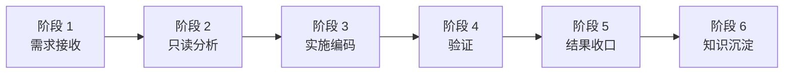

# 04-开发工作流

## 开发工作流说明

本项目采用 **AIDevault 开发框架** 的六阶段工作流，实现标准化、可追溯的研发流程。

## 六阶段工作流



---

## 阶段 1：需求接收

### 执行者
**OpenClaw**

### 目标
接收运维开发需求，整理任务信息，创建标准化任务文件。

### 步骤

#### 步骤 1.1：接收需求

**来源**：
- 用户 / 产品经理：新功能需求
- 架构师：架构优化需求
- 运维人员：问题修复需求

**内容**：
- 需求描述
- 预期目标
- 优先级
- 截止日期

#### 步骤 1.2：整理需求信息

**整理内容**：
```markdown
## 基本信息
- 任务编号：DEV-OV-XXX
- 任务名称：<功能名称>
- 状态：TODO
- 优先级：高 / 中 / 低
- 负责人：<负责人>
- 创建日期：YYYY-MM-DD

## 任务目标
<具体目标描述>

## 范围
<包含的功能>

## 非目标
<不包含的功能>

## 验收标准
1. <验收标准 1>
2. <验收标准 2>
3. <验收标准 3>

## 前置条件
- [ ] <前置条件 1>
- [ ] <前置条件 2>

## 风险项
- <风险 1>
- <风险 2>
```

#### 步骤 1.3：创建任务文件

**操作**：
1. 复制任务模板：
   ```bash
   cp templates/任务模板.md tasks/DEV-OV-XXX.md
   ```

2. 编辑任务文件，填写需求信息

3. 保存任务文件

#### 步骤 1.4：下发任务

**操作**：
```bash
# 使用 OpenClaw 下发任务
acpx claude -s oc-claude-openviking-001 "请执行 DEV-OV-XXX：<任务名称>"
```

**说明**：
- OpenClaw 创建 Claude Code ACP Session
- 将任务信息传递给 Claude Code
- 启动任务执行流程

### 输出

- **任务文件**：`tasks/DEV-OV-XXX.md`
- **Claude Code 会话**：已启动，等待执行

### 进入下一阶段

阶段 1 完成 → 进入 **阶段 2：只读分析**

---

## 阶段 2：只读分析

### 执行者
**Claude Code**

### 目标
在不修改代码前，完成只读分析，识别关键模块、风险点，输出实施方案。

### 原则
- **先分析，后编码**：不急于动手，先充分理解
- **风险前置识别**：提前发现潜在问题
- **方案清晰明确**：有明确的实施计划

### 步骤

#### 步骤 2.1：Glob 查找相关代码

**操作**：
```bash
# 查找相关文件
glob "**/*.{py,js,ts,go,rs}" --exclude "node_modules/**" --exclude ".venv/**"

# 查找特定模块文件
glob "**/{monitor,alert,ai,model,edge,network}/**/*"

# 查找配置文件
glob "**/*.{yaml,yml,json,toml}"
```

**目的**：快速定位相关代码文件

#### 步骤 2.2：Read 深度阅读代码

**操作**：
```bash
# 阅读关键文件
read src/main.py
read src/monitor/network_monitor.py
read src/ai/model_inference.py

# 阅读配置文件
read config.yaml
read docker-compose.yml
```

**目的**：
- 理解现有实现方式
- 分析代码结构和依赖关系
- 识别关键逻辑和算法

#### 步骤 2.3：Grep 搜索关键功能

**操作**：
```bash
# 搜索特定功能
grep "class.*Monitor" --include="*.py"
grep "def.*predict" --include="*.py"
grep "async def.*fetch" --include="*.py"

# 搜索特定模式
grep "TODO|FIXME|XXX" --include="*.py"
```

**目的**：
- 快速定位关键功能代码
- 发现潜在问题（TODO、FIXME）

#### 步骤 2.4：分析现有实现

**内容**：
1. **功能分析**：现有功能是否满足需求？
2. **架构分析**：现有架构是否合理？
3. **代码质量**：代码可读性、可维护性如何？
4. **依赖分析**：外部依赖是否合理？
5. **性能分析**：性能是否满足要求？

**输出**：
```markdown
## 现有实现分析

### 功能分析
- <现有功能>
- <是否满足需求>

### 架构分析
- <现有架构>
- <是否合理>

### 代码质量
- <代码可读性>
- <可维护性>

### 依赖分析
- <外部依赖>
- <是否合理>

### 性能分析
- <性能表现>
- <是否满足要求>
```

#### 步骤 2.5：识别风险点

**内容**：
1. **技术风险**：新技术、复杂算法、性能瓶颈
2. **依赖风险**：外部依赖、第三方库、API 变更
3. **架构风险**：架构不合理、扩展性不足
4. **安全风险**：安全漏洞、数据泄露、权限问题
5. **运维风险**：部署困难、监控不足、故障恢复

**输出**：
```markdown
## 风险识别

### 技术风险
- <风险描述>
- <影响程度>
- <应对措施>

### 依赖风险
- <风险描述>
- <影响程度>
- <应对措施>

### 架构风险
- <风险描述>
- <影响程度>
- <应对措施>

### 安全风险
- <风险描述>
- <影响程度>
- <应对措施>

### 运维风险
- <风险描述>
- <影响程度>
- <应对措施>
```

#### 步骤 2.6：输出实施方案

**内容**：
1. **实施步骤**：详细的实施步骤和顺序
2. **代码修改**：需要修改的文件和代码
3. **测试计划**：测试策略和测试用例
4. **风险应对**：针对风险点的应对措施
5. **回滚方案**：如果失败，如何回滚

**输出**：
```markdown
## 实施方案

### 实施步骤
1. <步骤 1>
2. <步骤 2>
3. <步骤 3>

### 代码修改
- <文件 1>：<修改内容>
- <文件 2>：<修改内容>

### 测试计划
- <测试策略>
- <测试用例>

### 风险应对
- <风险 1>：<应对措施>
- <风险 2>：<应对措施>

### 回滚方案
- <回滚步骤>
```

### 限制

- **只读操作**：不修改任何代码
- **不访问生产环境**：不直接访问运维环境
- **不执行高风险命令**：只执行查询和分析命令

### 输出

- **只读分析报告**：包含功能分析、架构分析、代码质量、依赖分析、性能分析
- **风险识别报告**：包含技术风险、依赖风险、架构风险、安全风险、运维风险
- **实施方案**：包含实施步骤、代码修改计划、测试计划、风险应对、回滚方案

### 进入下一阶段

阶段 2 完成 → 进入 **阶段 3：实施编码**

---

（后续阶段内容继续...）
