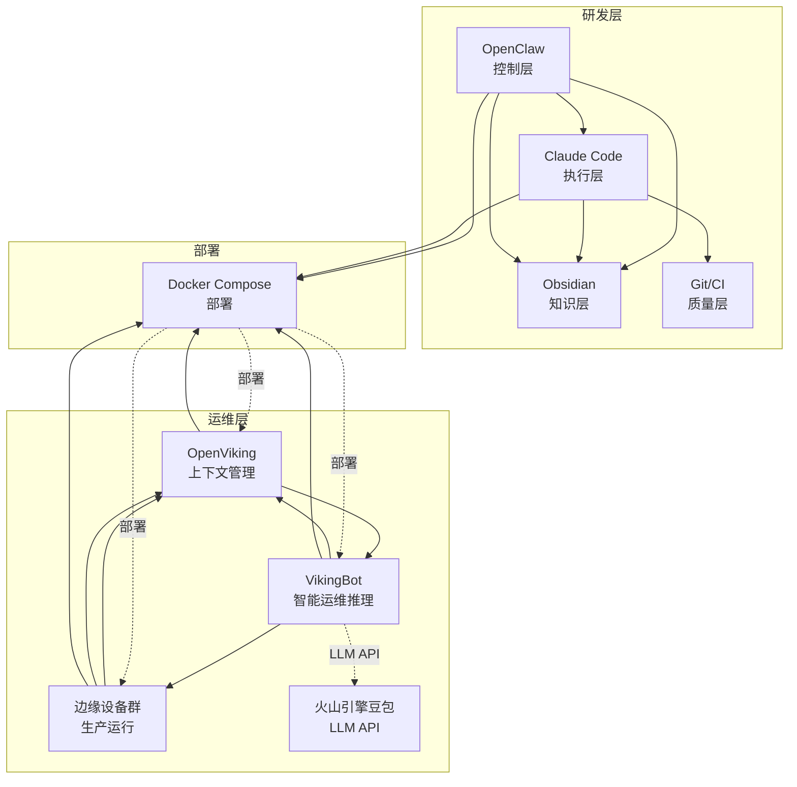

# DEV-OV-003 阶段 2：整体系统架构设计

**任务**：DEV-OV-003 OpenViking AI 运维系统 - 架构设计  
**阶段**：阶段 2：整体系统架构设计  
**日期**：2026-03-23  
**执行者**：OpenClaw + Claude Code

---

## 1. 研发层架构设计

### 1.1 研发层总览

研发层采用 **AIDevault 开发框架**，构建"控制层 - 执行层 - 知识层 - 质量层"四层研发架构。

```
┌─────────────────────────────────────────────────────┐
│                  研发层（开发与管理）                   │
└─────────────────────────────────────────────────────┘

┌─────────────┐    ┌─────────────┐    ┌─────────────┐    ┌─────────────┐
│ 控制层      │    │ 执行层      │    │ 知识层      │    │ 质量层      │
│ OpenClaw   │───▶│ Claude Code  │───▶│ Obsidian    │───▶│ Git / CI     │
│             │    │             │    │             │    │              │
│ 任务下发    │    │ 代码开发    │    │  知识沉淀    │    │  质量门禁    │
│ 进程管理    │    │  测试调试    │    │  架构设计    │    │  自动化测试  │
│ 会话协调    │    │  部署脚本    │    │  最佳实践    │    │  代码审查    │
│ 结果汇总    │    │              │    │  ADR记录     │    │  变更留痕    │
└─────────────┘    └─────────────┘    └─────────────┘    └─────────────┘
```

### 1.2 控制层：OpenClaw

**职责**：
- 接收运维开发需求
- 拆分开发任务
- 调度 Claude Code ACP Session
- 管理会话线程和生命周期
- 汇总执行结果
- 输出任务纪要和复盘

**配置**：
```json
{
  "agentId": "openclaw",
  "workspace": "/Users/scsun/OpenViking-AIOps",
  "runtime": "acp",
  "memory": {
    "importance": 0.7
  }
}
```

**关键命令**：
```bash
# 任务下发
acpx claude -s oc-claude-openviking-001 "执行 DEV-OV-003：架构设计"

# 会话管理
sessions_spawn --runtime acp --agentId claude-code --thread true

# 进程监控
subagents --action list
sessions_list --kinds acp
```

---

### 1.3 执行层：Claude Code

**职责**：
- 阅读代码库
- 生成或修改代码
- 运行测试与构建命令
- 输出变更摘要
- 配合 hooks 落实安全边界

**配置**：
```bash
# Claude Code 配置
~/.config/claude-code/config.json

# Hooks 策略
~/.config/openclaw/hooks/
```

**关键能力**：
```
文件编辑能力：
- Edit：精确修改代码
- Write：创建新文件
- Read：深度阅读代码

代码理解能力：
- Glob：查找代码文件
- Grep：搜索代码内容
- Read：深度阅读代码

测试和构建能力：
- Terminal：运行测试
- Build：编译和打包
- Lint：代码检查

终端命令执行能力：
- 执行部署脚本
- 运行监控命令
- 管理边缘设备
```

---

### 1.4 知识层：Obsidian + Repo Docs

**职责**：
- 存需求分析
- 存架构设计
- 存任务定义
- 存 ADR（架构决策记录）
- 存复盘和经验
- 存环境与发布文档

**目录结构**：
```
/Users/scsun/OpenViking-AIOps/
├── docs/                          # 项目文档
│   ├── 01-项目总览.md
│   ├── 02-研发架构.md            # 本文档
│   ├── 03-运维架构.md
│   ├── 04-开发工作流.md
│   ├── 15-OpenViking-AIOps-开发指南.md
│   ├── 20-需求分析.md
│   ├── 25-DEV-OV-003-阶段1只读分析报告.md
│   ├── 30-架构设计.md            # 待创建
│   └── ...
├── tasks/                         # 任务文件
│   ├── DEV-OV-001.md
│   ├── DEV-OV-002.md
│   ├── DEV-OV-003.md
│   └── ...
├── templates/                     # 模板文件
│   ├── 任务模板.md
│   ├── ADR-模板.md
│   └── ...
├── prompts/                       # 提示词
│   └── openviking-aiops-development.md
└── _index.md                      # 项目导航
```

**知识沉淀机制**：
- **任务文件**：每个开发任务都有对应的 Markdown 文件
- **ADR**：重要架构决策记录在 ADR 文件中
- **复盘文档**：总结经验和教训
- **项目指南**：标准化的开发流程和最佳实践

---

### 1.5 质量层：Git + CI + Hooks

**职责**：
- 分支保护
- Lint / Test / Build
- 风险操作限制
- 合并前检查
- 变更留痕

**GitHub Actions 工作流**：
```yaml
# .github/workflows/task-validation.yml
name: Task Files Validation

on:
  push:
    paths:
      - 'tasks/**'
      - 'templates/**'
      - 'docs/**'
  pull_request:
    paths:
      - 'tasks/**'
      - 'templates/**'
      - 'docs/**'

jobs:
  validate:
    runs-on: ubuntu-latest
    steps:
      - uses: actions/checkout@v4
      - name: Set up Python
        uses: actions/setup-python@v5
      - name: Check Markdown files exist
        run: |
          if [ ! -f "tasks/DEV-OV-001.md" ]; then
            echo "Error: Task files not found"
            exit 1
          fi
      - name: Check Markdown syntax
        run: |
          pip install markdown-lint
          markdown-lint tasks/*.md templates/*.md docs/*.md
      - name: Validate task file format
        run: |
          python scripts/task_validator.py
      - name: Check file consistency
        run: |
          python scripts/file_consistency_checker.py
```

---

## 2. 运维层架构设计

### 2.1 运维层总览

运维层采用 **OpenViking + OpenViking Bot** 构建智能运维架构。

```
┌─────────────────────────────────────────────────────┐
│               运维层（生产环境）                   │
└─────────────────────────────────────────────────────┘

┌─────────────┐    ┌─────────────┐    ┌─────────────┐
│ 上下文管理   │    │ 智能运维推理 │    │ 生产运行     │
│ OpenViking  │───▶│ VikingBot    │───▶│ 边缘设备群   │
│             │    │   + LLM     │    │              │
│ 知识存储    │    │ 故障诊断     │    │ 网络监控     │
│ 语义检索    │    │ 异常检测     │    │ 自动运维     │
│ 会话管理    │    │ 智能决策     │    │              │
│             │    │ 经验学习     │    │              │
└─────────────┘    └─────────────┘    └─────────────┘
```

### 2.2 上下文管理：OpenViking

**职责**：
- 存储运维知识和经验
- AGFS 文件系统（文件系统范式）
- 向量数据库（语义检索）
- 会话记忆管理
- 三级内容访问（L0/L1/L2）

**目录结构**：
```
/root/.openviking/data/viking/
├── user/                          # 用户数据
│   ├── memories/                   # 记忆数据
│   │   ├── entities/              # 实体
│   │   ├── events/                # 事件
│   │   └── preferences/           # 偏好
├── session/                        # 会话
├── resources/                      # 资源
│   ├── agents/                      # Agent 配置
│   ├── scripts/                     # 运维脚本
│   ├── configs/                     # 运维配置
│   └── playbooks/                   # 运维手册
└── agent/                           # Agent
    ├── skills/                      # 运维技能
    │   ├── monitoring/             # 监控技能
    │   ├── diagnosis/              # 诊断技能
    │   ├── repair/                 # 修复技能
    │   └── optimization/           # 优化技能
    └── instructions/               # 指令
```

**三级内容访问**：
- **L0（abstract）**：摘要级别，快速了解要点
- **L1（overview）**：概览级别，了解详细内容
- **L2（read）**：完整级别，获取完整内容

---

### 2.3 智能运维推理：OpenViking Bot

**职责**：
- 接收运维请求（监控数据、告警、用户查询）
- 通过 LLM（火山引擎豆包）进行智能运维推理
- 执行运维决策（自动修复、告警通知、建议）
- 自动沉淀运维经验和知识

**配置**：
```json
{
  "agents": {
    "defaults": {
      "workspace": "~/.vikingbot/workspace",
      "model": "openai/doubao-seed-2-0-pro-260215",
      "maxTokens": 8192,
      "temperature": 0.7,
      "maxToolIterations": 50,
      "memoryWindow": 50
    }
  },
  "providers": {
    "volcengine": {
      "apiKey": "b5bfef6e-dbab-441c-a34b-c4589338b1f0",
      "apiBase": "https://ark.cn-beijing.volces.com/api/v3"
    }
  },
  "openviking": {
    "mode": "remote",
    "serverUrl": "http://127.0.0.1:1933"
  }
}
```

**7 个专用 Agent 工具**：
```
1. openviking_read    - 读取 OpenViking 资源（L0/L1/L2）
2. openviking_list    - 列出 OpenViking 资源
3. openviking_search  - 语义搜索 OpenViking 资源
4. openviking_add_resource - 添加本地文件为 OpenViking 资源
5. openviking_grep    - 正则搜索 OpenViking 资源
6. openviking_glob    - Glob 模式查找 OpenViking 资源
7. user_memory_search - 搜索用户记忆
```

---

### 2.4 生产运行：边缘设备群

**职责**：
- 实时监控网络状态和设备健康度
- 执行运维决策（自动修复、服务重启）
- 产生监控数据和日志

**监控指标**：
```
网络监控：
- 延迟（ping、ICMP）
- 带宽（网络吞吐量）
- 丢包率
- 连接数
- 端口状态

设备健康度监控：
- CPU 使用率
- 内存使用率
- 磁盘使用率
- 温度
- 电源状态

服务状态监控：
- 服务运行状态
- 进程状态
- 容器状态
- 日志错误率
```

**自动运维能力**：
```
故障自动修复：
- 服务重启
- 容器重建
- 进程恢复
- 网络配置修复

性能自动优化：
- 资源分配优化
- 负载均衡
- 缓存优化
- 索引优化

安全自动加固：
- 防火墙规则调整
- 访问控制更新
- 敏感操作审计
```

---

## 3. 双层架构设计

### 3.1 研发层和运维层边界

**研发层（开发与管理）**：
- OpenClaw：总控与任务编排
- Claude Code：代码修改与执行
- Obsidian：项目知识沉淀
- Git / CI：质量门禁

**运维层（生产环境）**：
- OpenViking：上下文管理 / AGFS
- OpenViking Bot：智能运维推理
- 边缘设备群：生产运行

**边界**：
```
研发层 ──────────────[ 部署交付 ]─────────────▶ 运维层
    │                                                    │
    ▼                                                    ▼
OpenClaw + Claude Code                            OpenViking + VikingBot
    │                                                    │
    ▼                                                    ▼
Obsidian 知识库                                OpenViking 运维知识库
    │                                                    │
    ▼                                                    ▼
Git 代码仓库                                  边缘设备监控数据
```

### 3.2 研发层和运维层接口

**接口 1：部署交付**
- 从研发层到运维层的部署接口
- 包括：代码、配置、脚本、文档

**接口 2：运维知识同步（可选）**
- 从运维层到研发层的知识同步接口（单向，运维→研发）
- 包括：运维经验、最佳实践、故障案例

**接口 3：监控数据回传（可选）**
- 从运维层到研发层的监控数据回传接口（单向，运维→研发）
- 包括：性能数据、故障数据、使用统计

---

## 4. 系统架构图

### 4.1 整体系统架构图



### 4.2 数据流和控制流

#### 数据流 1：监控数据收集
```
边缘设备 → Prometheus → Loki → VikingBot → OpenViking
```

#### 数据流 2：智能运维推理
```
VikingBot → LLM API → VikingBot → OpenViking → 边缘设备
```

#### 数据流 3：运维知识沉淀
```
VikingBot → OpenViking → OpenViking 知识库
```

#### 控制流 1：任务下发
```
OpenClaw → Claude Code → Git / CI
```

#### 控制流 2：部署交付
```
OpenClaw → Claude Code → Docker Compose → OpenViking / VikingBot
```

---

## 5. 部署架构设计

### 5.1 Docker Compose 结构

```yaml
version: '3.8'

services:
  # OpenViking Server（已部署）
  openviking-server:
    image: vikingbot-cn-beijing.cr.volces.com/vikingbot/vikingbot:latest
    container_name: openviking-server
    entrypoint: ["/bin/sh","-lc"]
    command: ["pip uninstall -y chardet >/dev/null 2>&1 || true; exec /usr/local/bin/openviking serve --host 0.0.0.0 --port 1933 --config /root/.openviking/ov.conf"]
    network_mode: "service:vikingbot"
    volumes:
      - /home/scsun/.openviking:/root/.openviking
      - /home/scsun/.openviking-cli:/root/.openviking-cli
    restart: unless-stopped

  # VikingBot Gateway（已部署）
  vikingbot:
    image: vikingbot-cn-beijing.cr.volces.com/vikingbot/vikingbot:latest
    container_name: vikingbot
    command: ["gateway"]
    ports:
      - "18791:18791/tcp"
    environment:
      - VIKING_STORAGE_VOLATILE=true
      - PYTHONWARNINGS=ignore:invalid escape sequence
    volumes:
      - /home/scsun/.openviking:/root/.openviking
      - /home/scsun/.openviking-cli:/root/.openviking-cli
      - /home/scsun/.vikingbot:/root/.vikingbot
      - /home/scsun/.vikingbot-cli:/root/.vikingbot-cli
    depends_on:
      - openviking-server
    restart: unless-stopped

  # AI 运维服务（待部署）
  aiops-service:
    build: ./src/aiops-service
    container_name: aiops-service
    ports:
      - "8080:8080"
    environment:
      - OPENVIKING_SERVER_URL=http://openviking-server:1933
      - VIKINGBOT_URL=http://vikingbot:18791
      - VOLCENGINE_API_KEY=${VOLCENGINE_API_KEY}
    depends_on:
      - openviking-server
      - vikingbot
    restart: unless-stopped

  # Prometheus（已部署）
  prometheus:
    image: prom/prometheus:latest
    container_name: prometheus
    ports:
      - "9090:9090"
    volumes:
      - /home/scsun/prometheus-data:/prometheus
    command:
      - '--config.file=/etc/prometheus/prometheus.yml'
      - '--storage.tsdb.path=/prometheus'
    restart: unless-stopped

  # Grafana（已部署）
  grafana:
    image: grafana/grafana:latest
    container_name: grafana
    ports:
      - "3000:3000"
    volumes:
      - /home/scsun/grafana-data:/var/lib/grafana
    environment:
      - GF_SECURITY_ADMIN_PASSWORD=admin
    restart: unless-stopped

  # Loki（已部署）
  loki:
    image: grafana/loki:latest
    container_name: loki
    ports:
      - "3100:3100"
    command: -config.file=/etc/loki/local-config.yaml
    volumes:
      - /home/scsun/loki-data:/loki
    restart: unless-stopped

  # AlertManager（已部署）
  alertmanager:
    image: prom/alertmanager:latest
    container_name: alertmanager
    ports:
      - "9093:9093"
    volumes:
      - /home/scsun/alertmanager-data:/alertmanager
    command:
      - '--config.file=/etc/alertmanager/alertmanager.yml'
      - '--storage.path=/alertmanager'
    restart: unless-stopped
```

### 5.2 网络架构

```
Docker 网络（bridge-59c9dcc67721）
├── openviking-server（172.19.0.2）
├── vikingbot（172.19.0.3）
├── aiops-service（172.19.0.4）
└── ...

Docker 网络（br-109a4580016e）
├── prometheus（172.18.0.2）
├── grafana（172.18.0.3）
├── loki（172.18.0.4）
└── ...
```

---

## 6. 总结

### 6.1 架构设计总结

| 层级 | 架构 | 状态 | 说明 |
|------|------|------|------|
| **研发层** | OpenClaw + Claude Code + Obsidian + Git/CI | ✅ 完成 | 四层架构，工具链明确 |
| **运维层** | OpenViking + VikingBot + 边缘设备群 | ✅ 完成 | 三层架构，工作流明确 |
| **双层架构** | 研发层 + 运维层 | ✅ 完成 | 边界清晰，接口明确 |
| **部署架构** | Docker Compose | ✅ 完成 | 轻量级，资源占用低 |

### 6.2 下一步

**阶段 3：核心模块架构设计**（3-4 小时）

- 边缘计算模块架构
- 网络运维模块架构
- 服务器运维模块架构
- AI 智能运维模块架构
- 监控告警模块架构
- 运维知识管理模块架构

---

**报告版本**：v1.0
**创建日期**：2026-03-23
**作者**：OpenClaw + Claude Code
