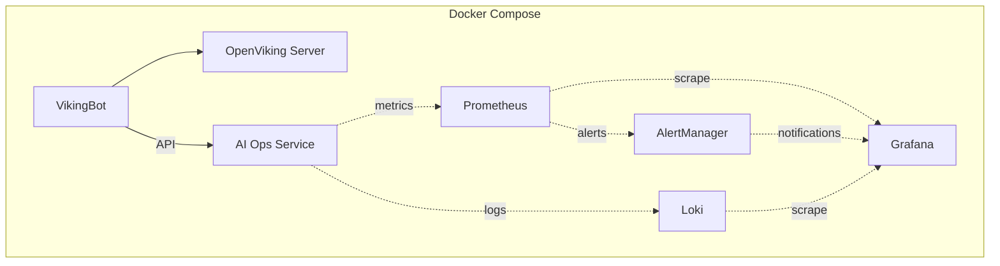
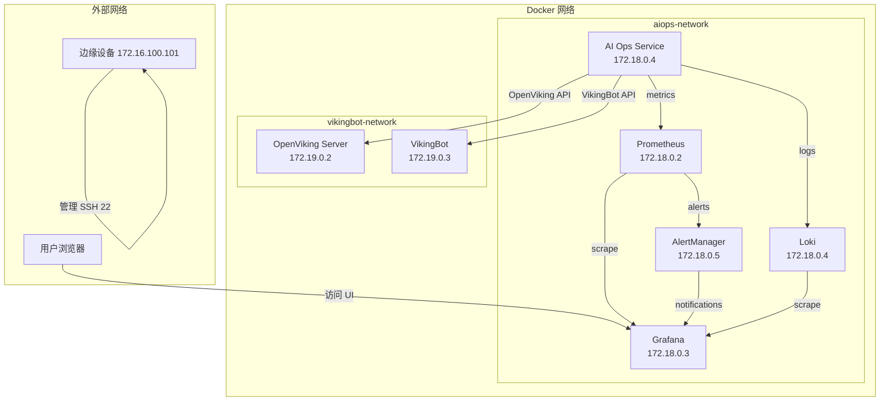

# DEV-OV-003 阶段 5：Docker Compose 部署架构设计

**任务**：DEV-OV-003 OpenViking AI 运维系统 - 架构设计  
**阶段**：阶段 5：Docker Compose 部署架构设计  
**日期**：2026-03-24  
**执行者**：OpenClaw + Claude Code

---

## 1. Docker Compose 结构设计

### 1.1 服务列表

基于之前的架构设计，Docker Compose 包含以下服务：

| 服务名称 | 镜像 | 端口 | 说明 |
|----------|------|------|------|
| **openviking-server** | vikingbot-cn-beijing.cr.volces.com/vikingbot/vikingbot:latest | 1933（内部） | OpenViking 上下文数据库 |
| **vikingbot** | vikingbot-cn-beijing.cr.volces.com/vikingbot/vikingbot:latest | 18791 | VikingBot Gateway |
| **aiops-service** | ./src/aiops-service | 8080 | AI 运维服务（待部署） |
| **prometheus** | prom/prometheus:latest | 9090 | Prometheus 监控 |
| **grafana** | grafana/grafana:latest | 3000 | Grafana 可视化 |
| **loki** | grafana/loki:latest | 3100 | Loki 日志收集 |
| **alertmanager** | prom/alertmanager:latest | 9093 | AlertManager 告警管理 |

**服务总数**：7 个

### 1.2 服务依赖关系



**依赖关系**：
- `aiops-service` 依赖 `openviking-server`（OpenViking API）
- `aiops-service` 依赖 `vikingbot`（VikingBot API）
- `grafana` 依赖 `prometheus`（Prometheus 数据源）
- `grafana` 依赖 `loki`（Loki 数据源）
- `alertmanager` 依赖 `prometheus`（Prometheus 告警）

---

## 2. Docker Compose 配置

### 2.1 docker-compose.yml

```yaml
version: '3.8'

services:
  # OpenViking Server（已部署）
  openviking-server:
    image: vikingbot-cn-beijing.cr.volces.com/vikingbot/vikingbot:latest
    container_name: openviking-server
    entrypoint: ["/bin/sh","-lc"]
    command: ["pip uninstall -y chardet >/dev/null 2>&1 || true; exec /usr/local/bin/openviking serve --host 0.0.0.0 --port 1933 --config /root/.openviking/ov.conf"]
    network_mode: "service:vikingbot"
    volumes:
      - /home/scsun/.openviking:/root/.openviking
      - /home/scsun/.openviking-cli:/root/.openviking-cli
    restart: unless-stopped
    healthcheck:
      test: ["CMD", "curl", "-f", "http://localhost:1933/health"]
      interval: 30s
      timeout: 10s
      retries: 3
      start_period: 40s

  # VikingBot Gateway（已部署）
  vikingbot:
    image: vikingbot-cn-beijing.cr.volces.com/vikingbot/vikingbot:latest
    container_name: vikingbot
    command: ["gateway"]
    ports:
      - "18791:18791/tcp"
    environment:
      - VIKING_STORAGE_VOLATILE=true
      - PYTHONWARNINGS=ignore:invalid escape sequence
    volumes:
      - /home/scsun/.openviking:/root/.openviking
      - /home/scsun/.openviking-cli:/root/.openviking-cli
      - /home/scsun/.vikingbot:/root/.vikingbot
      - /home/scsun/.vikingbot-cli:/root/.vikingbot-cli
    depends_on:
      openviking-server:
        condition: service_healthy
    restart: unless-stopped
    healthcheck:
      test: ["CMD", "curl", "-f", "http://localhost:18791/health"]
      interval: 30s
      timeout: 10s
      retries: 3
      start_period: 40s

  # AI 运维服务（待部署）
  aiops-service:
    build: ./src/aiops-service
    container_name: aiops-service
    ports:
      - "8080:8080"
    environment:
      - OPENVIKING_SERVER_URL=http://openviking-server:1933
      - VIKINGBOT_URL=http://vikingbot:18791
      - VOLCENGINE_API_KEY=${VOLCENGINE_API_KEY}
      - LOG_LEVEL=INFO
    depends_on:
      openviking-server:
        condition: service_healthy
      vikingbot:
        condition: service_healthy
    restart: unless-stopped
    healthcheck:
      test: ["CMD", "curl", "-f", "http://localhost:8080/health"]
      interval: 30s
      timeout: 10s
      retries: 3
      start_period: 40s
    networks:
      - aiops-network

  # Prometheus（已部署）
  prometheus:
    image: prom/prometheus:latest
    container_name: prometheus
    ports:
      - "9090:9090"
    volumes:
      - /home/scsun/prometheus-data:/prometheus
      - ./config/prometheus/prometheus.yml:/etc/prometheus/prometheus.yml
    command:
      - '--config.file=/etc/prometheus/prometheus.yml'
      - '--storage.tsdb.path=/prometheus'
      - '--web.console.libraries=/etc/prometheus/console_libraries'
      - '--web.console.templates=/etc/prometheus/consoles'
      - '--storage.tsdb.retention.time=200h'
      - '--web.enable-lifecycle'
    networks:
      - aiops-network
    restart: unless-stopped

  # Grafana（已部署）
  grafana:
    image: grafana/grafana:latest
    container_name: grafana
    ports:
      - "3000:3000"
    volumes:
      - /home/scsun/grafana-data:/var/lib/grafana
      - ./config/grafana/provisioning:/etc/grafana/provisioning
      - ./config/grafana/dashboards:/var/lib/grafana/dashboards
    environment:
      - GF_SECURITY_ADMIN_PASSWORD=${GF_SECURITY_ADMIN_PASSWORD}
      - GF_INSTALL_PLUGINS=grafana-piechart-panel
      - GF_SERVER_ROOT_URL=http://localhost:3000
      - GF_USERS_ALLOW_SIGN_UP=false
    depends_on:
      prometheus:
        condition: service_started
      loki:
        condition: service_started
    networks:
      - aiops-network
    restart: unless-stopped

  # Loki（已部署）
  loki:
    image: grafana/loki:latest
    container_name: loki
    ports:
      - "3100:3100"
    volumes:
      - /home/scsun/loki-data:/loki
      - ./config/loki/local-config.yaml:/etc/loki/local-config.yaml
    command: -config.file=/etc/loki/local-config.yaml
    networks:
      - aiops-network
    restart: unless-stopped

  # AlertManager（已部署）
  alertmanager:
    image: prom/alertmanager:latest
    container_name: alertmanager
    ports:
      - "9093:9093"
    volumes:
      - /home/scsun/alertmanager-data:/alertmanager
      - ./config/alertmanager/alertmanager.yml:/etc/alertmanager/alertmanager.yml
    command:
      - '--config.file=/etc/alertmanager/alertmanager.yml'
      - '--storage.path=/alertmanager'
      - '--web.external-url=http://localhost:9093'
    networks:
      - aiops-network
    depends_on:
      prometheus:
        condition: service_started
    restart: unless-stopped

networks:
  aiops-network:
    driver: bridge
  vikingbot-network:
    driver: bridge

volumes:
  prometheus-data:
  grafana-data:
  loki-data:
  alertmanager-data:
```

### 2.2 环境变量文件

创建 `.env` 文件：

```bash
# Volcengine API Key
VOLCENGINE_API_KEY=b5bfef6e-dbab-441c-a34b-c4589338b1f0

# Grafana Admin Password
GF_SECURITY_ADMIN_PASSWORD=aiops_admin_2026

# Log Level
LOG_LEVEL=INFO
```

---

## 3. 网络架构设计

### 3.1 网络拓扑



### 3.2 网络配置

**aiops-network**：
- **驱动**：bridge
- **子网**：172.18.0.0/16
- **网关**：172.18.0.1
- **DNS**：8.8.8.8（Google DNS）

**vikingbot-network**：
- **驱动**：bridge
- **子网**：172.19.0.0/16
- **网关**：172.19.0.1
- **DNS**：8.8.8.8（Google DNS）

### 3.3 端口映射

| 服务 | 内部端口 | 外部端口 | 访问地址 |
|------|----------|----------|----------|
| OpenViking Server | 1933 | - | vikingbot-network 内部 |
| VikingBot Gateway | 18791 | 18791 | http://172.16.100.101:18791 |
| AI Ops Service | 8080 | 8080 | http://172.16.100.101:8080 |
| Prometheus | 9090 | 9090 | http://172.16.100.101:9090 |
| Grafana | 3000 | 3000 | http://172.16.100.101:3000 |
| Loki | 3100 | 3100 | http://172.16.100.101:3100 |
| AlertManager | 9093 | 9093 | http://172.16.100.101:9093 |

**内部访问**：
- `openviking-server`：通过 `vikingbot-network` 内部访问（http://openviking-server:1933）
- `vikingbot`：通过 `vikingbot-network` 内部访问（http://vikingbot:18791）

**外部访问**：
- `VikingBot Gateway`：http://172.16.100.101:18791
- `AI Ops Service`：http://172.16.100.101:8080
- `Prometheus`：http://172.16.100.101:9090
- `Grafana`：http://172.16.100.101:3000
- `Loki`：http://172.16.100.101:3100
- `AlertManager`：http://172.16.100.101:9093

---

## 4. 数据持久化设计

### 4.1 数据卷定义

| 数据卷 | 路径 | 说明 |
|--------|------|------|
| `prometheus-data` | `/home/scsun/prometheus-data:/prometheus` | Prometheus 时序数据 |
| `grafana-data` | `/home/scsun/grafana-data:/var/lib/grafana` | Grafana 数据（用户、面板、仪表板） |
| `loki-data` | `/home/scsun/loki-data:/loki` | Loki 日志数据 |
| `alertmanager-data` | `/home/scsun/alertmanager-data:/alertmanager` | AlertManager 通知数据 |

### 4.2 配置文件映射

| 配置文件 | 宿主机路径 | 容器路径 | 说明 |
|----------|-----------|-----------|------|
| `prometheus.yml` | `./config/prometheus/prometheus.yml` | `/etc/prometheus/prometheus.yml` | Prometheus 配置 |
| `grafana/provisioning` | `./config/grafana/provisioning/` | `/etc/grafana/provisioning/` | Grafana 配置（数据源、仪表板） |
| `grafana/dashboards` | `./config/grafana/dashboards/` | `/var/lib/grafana/dashboards/` | Grafana 仪表板 |
| `loki/local-config.yaml` | `./config/loki/local-config.yaml` | `/etc/loki/local-config.yaml` | Loki 配置 |
| `alertmanager.yml` | `./config/alertmanager/alertmanager.yml` | `/etc/alertmanager/alertmanager.yml` | AlertManager 配置 |

### 4.3 OpenViking 数据卷

| 数据卷 | 宿主机路径 | 容器路径 | 说明 |
|--------|-----------|-----------|------|
| OpenViking 数据 | `/home/scsun/.openviking:/root/.openviking` | `/root/.openviking` | OpenViking 存储数据 |
| OpenViking CLI | `/home/scsun/.openviking-cli:/root/.openviking-cli` | `/root/.openviking-cli` | OpenViking CLI 工具 |
| VikingBot 数据 | `/home/scsun/.vikingbot:/root/.vikingbot` | `/root/.vikingbot` | VikingBot 工作空间 |
| VikingBot CLI | `/home/scsun/.vikingbot-cli:/root/.vikingbot-cli` | `/root/.vikingbot-cli` | VikingBot CLI 工具 |

---

## 5. 部署脚本设计

### 5.1 部署脚本

创建 `scripts/deploy.sh`：

```bash
#!/bin/bash
set -e

echo "=========================================="
echo "OpenViking AI 运维系统部署脚本"
echo "=========================================="

# 检查环境
echo "[1/6] 检查环境..."
if [ -z "$VOLCENGINE_API_KEY" ]; then
    echo "错误：VOLCENGINE_API_KEY 环境变量未设置"
    exit 1
fi

if ! command -v docker &> /dev/null; then
    echo "错误：Docker 未安装"
    exit 1
fi

if ! command -v docker-compose &> /dev/null; then
    echo "错误：Docker Compose 未安装"
    exit 1
fi

echo "环境检查完成！"

# 创建配置目录
echo "[2/6] 创建配置目录..."
mkdir -p ./config/prometheus
mkdir -p ./config/grafana/provisioning
mkdir -p ./config/grafana/dashboards
mkdir -p ./config/loki
mkdir -p ./config/alertmanager
echo "配置目录创建完成！"

# 生成配置文件
echo "[3/6] 生成配置文件..."
cat > ./config/prometheus/prometheus.yml << EOF
global:
  scrape_interval: 15s
  evaluation_interval: 15s

scrape_configs:
  - job_name: 'aiops-service'
    static_configs:
      - targets: ['aiops-service:8080']
    metrics_path: '/metrics'
    scrape_interval: 30s
    scrape_timeout: 10s
EOF

cat > ./config/loki/local-config.yaml << EOF
auth_enabled: false

server:
  http_listen_port: 3100

limits_config:
  enforce_metric_name: false
  reject_old_samples: true
  reject_old_samples_max_age: 168h

ingester:
  lifecycler:
    address: "http://loki:3100"
  chunk_block_size: 262144
  chunk_idle_timeout: 1h

schema_config:
  configs:
    - from: 2020-10-24
      store: boltdb-shipper
      object_store: filesystem
      schema: v11
      index:
        prefix: index_
        period: 24h

storage_config:
  filesystem:
    directory: /loki

compactor:
  working_directory: /loki/compactor
EOF

cat > ./config/alertmanager/alertmanager.yml << EOF
global:
  resolve_timeout: 5m
  smtp_smarthost: 'localhost:25'
  smtp_from: 'alertmanager@example.com'

route:
  group_by: ['alertname']
  group_wait: 10s
  group_interval: 10s
  repeat_interval: 12h
  receiver: 'web.hook'

receivers:
  - name: 'web.hook'
    webhook_configs:
      - url: 'http://vikingbot:18791/api/alerts/webhook'
EOF

echo "配置文件生成完成！"

# 构建镜像
echo "[4/6] 构建 AI 运维服务镜像..."
docker-compose build aiops-service
echo "镜像构建完成！"

# 启动服务
echo "[5/6] 启动服务..."
docker-compose up -d
echo "服务启动完成！"

# 健康检查
echo "[6/6] 健康检查..."
sleep 10

# 检查服务状态
echo "检查服务状态..."
docker-compose ps

# 检查健康状态
echo "检查健康状态..."
curl -f http://localhost:8080/health || echo "AI 运维服务：不健康"
curl -f http://localhost:18791/health || echo "VikingBot：不健康"

echo "=========================================="
echo "部署完成！"
echo "=========================================="
echo ""
echo "访问地址："
echo "- VikingBot Gateway: http://172.16.100.101:18791"
echo "- AI Ops Service: http://172.16.100.101:8080"
echo "- Prometheus: http://172.16.100.101:9090"
echo "- Grafana: http://172.16.100.101:3000"
echo "- Loki: http://172.16.100.101:3100"
echo "- AlertManager: http://172.16.100.101:9093"
echo ""
echo "默认用户名/密码："
echo "- Grafana: admin / aiops_admin_2026"
echo ""
```

### 5.2 停止脚本

创建 `scripts/stop.sh`：

```bash
#!/bin/bash
set -e

echo "=========================================="
echo "OpenViking AI 运维系统停止脚本"
echo "=========================================="

echo "[1/1] 停止服务..."
docker-compose down
echo "服务停止完成！"

echo "=========================================="
echo "停止完成！"
echo "=========================================="
```

### 5.3 重启脚本

创建 `scripts/restart.sh`：

```bash
#!/bin/bash
set -e

echo "=========================================="
echo "OpenViking AI 运维系统重启脚本"
echo "=========================================="

echo "[1/2] 停止服务..."
docker-compose down
echo "服务停止完成！"

echo "[2/2] 启动服务..."
docker-compose up -d
echo "服务启动完成！"

echo "=========================================="
echo "重启完成！"
echo "=========================================="
```

---

## 6. 备份策略

### 6.1 数据备份

**自动备份**（Cron Job）：

创建 `scripts/backup.sh`：

```bash
#!/bin/bash
set -e

BACKUP_DIR="/home/scsun/backups"
TIMESTAMP=$(date +%Y%m%d_%H%M%S)

echo "[$TIMESTAMP] 开始备份数据..."

# 备份 Prometheus 数据
docker exec prometheus tar czf /tmp/prometheus-$TIMESTAMP.tar.gz /prometheus
docker cp prometheus:/tmp/prometheus-$TIMESTAMP.tar.gz $BACKUP_DIR/prometheus-$TIMESTAMP.tar.gz

# 备份 Grafana 数据
docker exec grafana tar czf /tmp/grafana-$TIMESTAMP.tar.gz /var/lib/grafana
docker cp grafana:/tmp/grafana-$TIMESTAMP.tar.gz $BACKUP_DIR/grafana-$TIMESTAMP.tar.gz

# 备份 Loki 数据
docker exec loki tar czf /tmp/loki-$TIMESTAMP.tar.gz /loki
docker cp loki:/tmp/loki-$TIMESTAMP.tar.gz $BACKUP_DIR/loki-$TIMESTAMP.tar.gz

# 备份 AlertManager 数据
docker exec alertmanager tar czf /tmp/alertmanager-$TIMESTAMP.tar.gz /alertmanager
docker cp alertmanager:/tmp/alertmanager-$TIMESTAMP.tar.gz $BACKUP_DIR/alertmanager-$TIMESTAMP.tar.gz

# 备份 OpenViking 数据
tar czf $BACKUP_DIR/openviking-$TIMESTAMP.tar.gz /home/scsun/.openviking
tar czf $BACKUP_DIR/vikingbot-$TIMESTAMP.tar.gz /home/scsun/.vikingbot

echo "[$TIMESTAMP] 备份完成！"

# 清理旧备份（保留最近 7 天）
find $BACKUP_DIR -name "*.tar.gz" -mtime +7 -delete

echo "[$TIMESTAMP] 旧备份清理完成！"
```

**Cron Job**：

```bash
# 每天凌晨 2 点自动备份
0 2 * * * /home/scsun/scripts/backup.sh >> /home/scsun/backups/backup.log 2>&1
```

### 6.2 数据恢复

创建 `scripts/restore.sh`：

```bash
#!/bin/bash
set -e

if [ -z "$1" ]; then
    echo "用法：./restore.sh <TIMESTAMP>"
    exit 1
fi

BACKUP_DIR="/home/scsun/backups"
TIMESTAMP=$1

echo "[$TIMESTAMP] 开始恢复数据..."

# 恢复 Prometheus 数据
docker exec -i prometheus tar xzf /tmp/prometheus-$TIMESTAMP.tar.gz -C /
docker cp $BACKUP_DIR/prometheus-$TIMESTAMP.tar.gz prometheus:/tmp/
docker exec prometheus tar xzf /tmp/prometheus-$TIMESTAMP.tar.gz -C /

# 恢复 Grafana 数据
docker exec -i grafana tar xzf /tmp/grafana-$TIMESTAMP.tar.gz -C /
docker cp $BACKUP_DIR/grafana-$TIMESTAMP.tar.gz grafana:/tmp/
docker exec grafana tar xzf /tmp/grafana-$TIMESTAMP.tar.gz -C /

# 恢复 Loki 数据
docker exec -i loki tar xzf /tmp/loki-$TIMESTAMP.tar.gz -C /
docker cp $BACKUP_DIR/loki-$TIMESTAMP.tar.gz loki:/tmp/
docker exec loki tar xzf /tmp/loki-$TIMESTAMP.tar.gz -C /

# 恢复 AlertManager 数据
docker exec -i alertmanager tar xzf /tmp/alertmanager-$TIMESTAMP.tar.gz -C /
docker cp $BACKUP_DIR/alertmanager-$TIMESTAMP.tar.gz alertmanager:/tmp/
docker exec alertmanager tar xzf /tmp/alertmanager-$TIMESTAMP.tar.gz -C /

# 重启服务
echo "[$TIMESTAMP] 重启服务..."
docker-compose restart

echo "[$TIMESTAMP] 恢复完成！"
```

---

## 7. 监控和告警配置

### 7.1 Prometheus 配置

**Prometheus 抓取目标**：

```yaml
scrape_configs:
  - job_name: 'aiops-service'
    static_configs:
      - targets: ['aiops-service:8080']
    metrics_path: '/metrics'
    scrape_interval: 30s
    scrape_timeout: 10s

  - job_name: 'vikingbot'
    static_configs:
      - targets: ['vikingbot:18791']
    metrics_path: '/metrics'
    scrape_interval: 30s
    scrape_timeout: 10s
```

**Prometheus 记录规则**：

```yaml
recording_rules:
  - name: 'aiops_service_aggregate'
    rules:
      - record: 'job:aiops_service:latency_seconds:p99'
        expr: histogram_quantile(0.99, rate(http_request_duration_seconds_bucket[5m]))
      - record: 'job:aiops_service:throughput'
        expr: sum(rate(http_requests_total{job="aiops-service"}[5m]))
```

### 7.2 Grafana 配置

**Grafana 数据源**：

1. Prometheus 数据源：
   - URL：http://prometheus:9090
   - Access：Server (default)

2. Loki 数据源：
   - URL：http://loki:3100
   - Access：Server (default)

**Grafana 仪表板**：

1. AI 运维系统监控
2. 网络监控
3. 服务器监控
4. AI 智能运维性能监控

### 7.3 AlertManager 配置

**告警路由**：

```yaml
route:
  group_by: ['alertname', 'job']
  group_wait: 10s
  group_interval: 10s
  repeat_interval: 12h
  receiver: 'web.hook'

receivers:
  - name: 'web.hook'
    webhook_configs:
      - url: 'http://vikingbot:18791/api/alerts/webhook'
        send_resolved: true
```

---

## 8. 总结

### 8.1 Docker Compose 部署架构总结

| 组件 | 配置 | 说明 |
|------|------|------|
| **服务数** | 7 | openviking-server、vikingbot、aiops-service、prometheus、grafana、loki、alertmanager |
| **网络数** | 2 | aiops-network、vikingbot-network |
| **数据卷** | 7 | prometheus-data、grafana-data、loki-data、alertmanager-data、openviking、vikingbot |
| **外部端口** | 6 | 18791、8080、9090、3000、3100、9093 |

### 8.2 部署流程

1. **准备环境**：
   - 安装 Docker 和 Docker Compose
   - 设置环境变量（`.env` 文件）
   - 创建配置目录和文件

2. **构建镜像**：
   - 构建 `aiops-service` 镜像

3. **启动服务**：
   - 启动所有服务（依赖关系自动处理）

4. **健康检查**：
   - 检查所有服务状态
   - 检查服务健康度

5. **配置监控和告警**：
   - 配置 Prometheus 抓取目标
   - 配置 Grafana 数据源和仪表板
   - 配置 AlertManager 告警规则

---

### 8.3 下一步

**阶段 6：架构决策记录和文档编写**（1-2 小时）

1. 创建架构决策记录 ADR
2. 整合架构设计文档
3. 更新任务文件和任务看板

---

**报告版本**：v1.0  
**创建日期**：2026-03-24  
**作者**：OpenClaw + Claude Code
